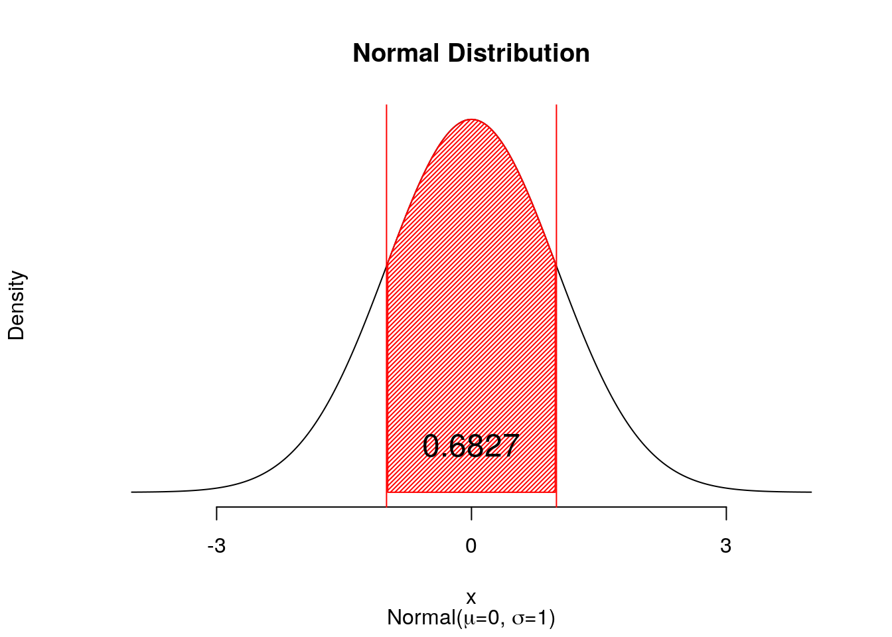
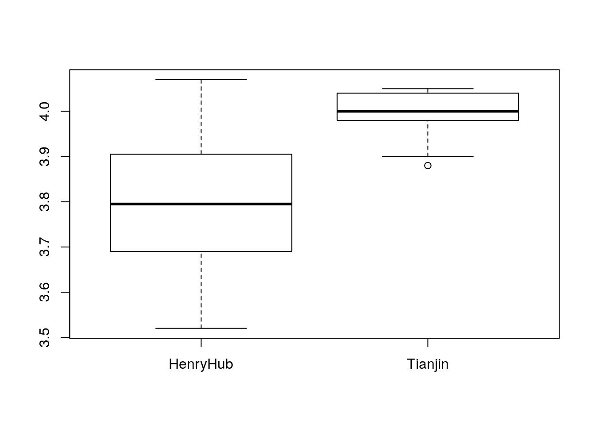
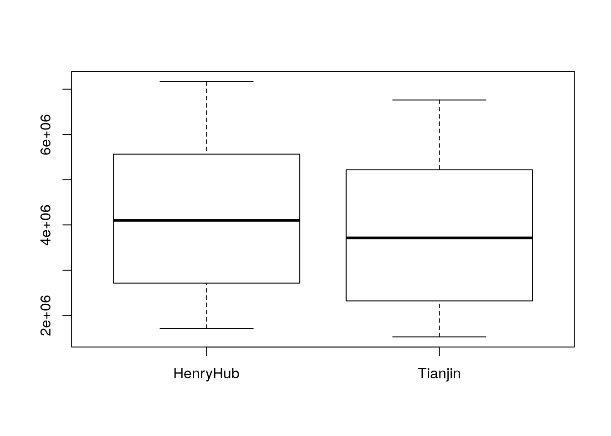
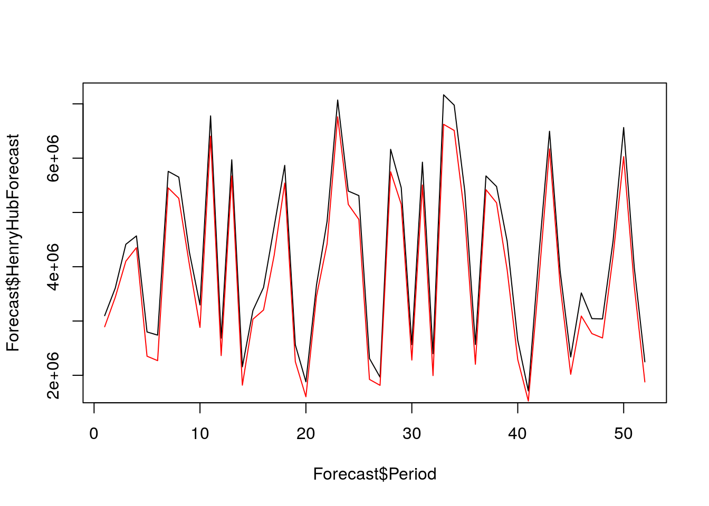

# A Practice Midterm

Answer the following questions in as much detail as possible in the time permitted.  In the exam format, partial credit will be awarded in the event that the reasoning is sufficiently clear to uncover the parts of a question correctly answered.  Answer the questions to the best of your ability and be systematic in solving the problems.  This will always take you far.  A Workbook called *NaturalGas2018.xls* contains the necessary data.

1.	What is the probability that a log-normal random variable [in R, lnorm is the noun] whose logarithm has mean equal to 0 and standard deviation equal to 1, takes values less than 1?


```r
plnorm(1)
```

```
## [1] 0.5
```


2.	What is the value of a log-normal random variable [in R, lnorm is the noun] whose logarithm has mean equal to 0 and standard deviation equal to 1, such that 0.95 of the probability is below said value?


```r
qlnorm(0.95)
```

```
## [1] 5.180252
```

3.	Find the plus/minus z such that the area in red is exactly equal to 0.6827 as shown below.  *There is $1-0.6827=0.3173$ outside of the noted  interval which corresponds to $\frac{0.3173}{2}$ in each tail.*

<!-- -->

*Between -1 and 1.  The empirical rule.*

## The Case

**A chemical manufacturer will build a new epoxy plant in one of two locations -- one adjacent to an extant facility in Tianjin, China and one near the company's headquarters in the United States near Henry Hub in Louisiana.  The plant is a first-of-its-kind entirely automated plant that hosts only a tiny number of supervisors and labor costs across the two locations do not differ.  The only input that might reasonably differ in cost is energy.  Where to locate the factory and potential differences in the cost of energy will play a crucial role in our decision.**

## An Energy Cost Comparison

An intern has collected two random samples of energy prices from local newspapers for comparison.  Over the last six months, the intern has a random sample of size 25 from Tianjin and a random sample of size 36 from Henry Hub reported in *Newspapers* -- a sheet in the Excel Workbook on WISE referenced above.  You are to undertake an initial summary of these data.  You should note that both prices are reported in United States dollars per Million BTU (million British thermal units).  The dates that the prices (spot) were recorded is listed in the adjacent column for each series.  The worksheet contains the data in both a stacked and an unstacked format.

1.	Provide a single plot combining the two samples of data. Which of the two series is more symmetric? What information in the plot led you to this choice?  *Henry Hub is far more symmetric.*  It is even more useful to plot the z-scores to match up the scales.  The process requires a few steps.  First, I standardize each variable.  Then I stack them to render them on a single picture.

A combined boxplot tells the story fairly clearly.  Once the data are stacked, plotting by groups becomes an option.  Here, it is clear tht Henry Hub is symmetric while Tianjin is not.


```r
boxplot(Price~Location, data=Newspapers)
```

<!-- -->

2.	Provide an appropriate numerical summary of each set of data given your plots.


```r
library(tidyverse)
library(skimr)
Newspapers %>% group_by(Location) %>% skim(Price)
```

```
## Skim summary statistics
##  n obs: 61 
##  n variables: 7 
##  group variables: Location 
## 
## ── Variable type:numeric ─────────────────────────────────────────────────────────────────────────────────────────────────────────────
##  Location variable missing complete  n mean    sd   p0  p25  p50  p75 p100
##  HenryHub    Price       0       36 36 3.8  0.14  3.52 3.69 3.79 3.9  4.07
##   Tianjin    Price       0       25 25 3.99 0.051 3.88 3.98 4    4.04 4.05
##      hist
##  ▃▃▇▅▆▇▁▃
##  ▂▂▁▁▁▆▃▇
```

3.	What is the sample mean and sample standard deviation of natural gas prices in Tianjin?


```r
# Mean
mean(Newspapers$TianjinPrice, na.rm=TRUE)
```

```
## [1] 3.9944
```

```r
meanTJ <- mean(Newspapers$TianjinPrice, na.rm=TRUE)
# Std. Dev.
sd(Newspapers$TianjinPrice, na.rm=TRUE)
```

```
## [1] 0.05066886
```

```r
sdTJ <- sd(Newspapers$TianjinPrice, na.rm=TRUE)
```


4.	What is a 95% (central) confidence interval for the average price in Tianjin given this precise sample? Provide both boundaries.


```r
t.test(Newspapers$TianjinPrice, alternative='two.sided', mu=0.0, conf.level=.95)
```

```
## 
## 	One Sample t-test
## 
## data:  Newspapers$TianjinPrice
## t = 394.17, df = 24, p-value < 2.2e-16
## alternative hypothesis: true mean is not equal to 0
## 95 percent confidence interval:
##  3.973485 4.015315
## sample estimates:
## mean of x 
##    3.9944
```

5.	Assume that the underlying population is normal with the population mean and population standard deviation exactly equal to the sample mean and standard deviation that you have estimated from the sample from Tianjin. What is the probability of a daily price of $4.00 or higher at Tianjin?


```r
pnorm(4, mean=3.9944, sd=0.05, lower.tail=FALSE)
```

```
## [1] 0.4554117
```

```r
pnorm(4, mean=meanTJ, sd=sdTJ, lower.tail=FALSE)
```

```
## [1] 0.4559979
```


6.	Is a mean price of $4.00 or lower given the Henry Hub data possible with 95% confidence?


```r
t.test(Newspapers$TianjinPrice, alternative='greater', mu=4, conf.level=.95)
```

```
## 
## 	One Sample t-test
## 
## data:  Newspapers$TianjinPrice
## t = -0.55261, df = 24, p-value = 0.7072
## alternative hypothesis: true mean is greater than 4
## 95 percent confidence interval:
##  3.977062      Inf
## sample estimates:
## mean of x 
##    3.9944
```

The probability is the p-value above.  Or it is 0.7071795.


7.	What is a 95% confidence interval of the difference in average prices. This calculation requires an assumption about the variances/standard deviations of the two samples that you have. What have you assumed? Why? Is there any information in the plot that you provided that might inform this decision?

*The samples have very different standard deviations.  Henry Hub's data entirely spans Tianjin's data; the ratio of the standard deviations is over 2 to 1.  I will assume that they are unequal.*  I cannot know that this is right, but intuition suggests it.  I show what happens if we assume them the same below that.  


```r
t.test(Price~Location, alternative='two.sided', conf.level=.95, var.equal=FALSE, data=Newspapers)
```

```
## 
## 	Welch Two Sample t-test
## 
## data:  Price by Location
## t = -7.8139, df = 47.036, p-value = 4.811e-10
## alternative hypothesis: true difference in means is not equal to 0
## 95 percent confidence interval:
##  -0.2496880 -0.1474454
## sample estimates:
## mean in group HenryHub  mean in group Tianjin 
##               3.795833               3.994400
```

```r
t.test(Price~Location, alternative='two.sided', conf.level=.95, var.equal=TRUE, data=Newspapers)
```

```
## 
## 	Two Sample t-test
## 
## data:  Price by Location
## t = -6.7835, df = 59, p-value = 6.285e-09
## alternative hypothesis: true difference in means is not equal to 0
## 95 percent confidence interval:
##  -0.2571402 -0.1399931
## sample estimates:
## mean in group HenryHub  mean in group Tianjin 
##               3.795833               3.994400
```

**Henry Hub is cheaper.  With 95% confidence, the average price in Henry Hub is $0.25 to $0.15 lower.**  This difference in prices suggests the factory should be build at Henry Hub.  If we assume equal variances, the range is now $0.26 to $0.14 cheaper in Henry Hub.  The decision does not depend on the assumption.


## Profit Forecasting by Location

The division that is principally entrusted with forecasting and the supply chain has calculated a series of profit forecasts in dollars for the first 52 weeks after completion of the factory in Tianjin and the factory in Henry Hub.  Because the production process is one-of-a-kind, it is known that the first 52 weeks will involve planned calibration of the factory; this is accounted for in the weekly forecasts and is the same pattern across both locations.  These forecasts appear in worksheet *Forecast* of the workbook on WISE.


1.	Graphically and numerically summarize profits by location.


```r
names(Forecast)
```

```
## [1] "Period"           "TianjinForecast"  "HenryHubForecast"
## [4] "Forecast"         "Location"
```

```r
summary(Forecast$TianjinForecast)
```

```
##    Min. 1st Qu.  Median    Mean 3rd Qu.    Max.    NA's 
## 1525784 2336259 3713691 3860590 5197883 6761850      52
```

```r
sd(Forecast$TianjinForecast, na.rm=TRUE)
```

```
## [1] 1561618
```

```r
summary(Forecast$HenryHubForecast)
```

```
##    Min. 1st Qu.  Median    Mean 3rd Qu.    Max.    NA's 
## 1712033 2726456 4101824 4204475 5520862 7166874      52
```

```r
sd(Forecast$HenryHubForecast, na.rm=TRUE)
```

```
## [1] 1590365
```


```r
boxplot(Forecast~Location, data=Forecast)
```

<!-- -->

This hides the pattern in the data.  Better shown like this:


```r
plot(Forecast$Period, Forecast$HenryHubForecast, type="l")
lines(Forecast$Period, Forecast$TianjinForecast, col="red")
```

<!-- -->

2. Provide an appropriate 95% confidence interval for average profits per week over the 52 week period in Tianjin, China.


```r
t.test(Forecast$TianjinForecast, alternative='two.sided', mu=0.0, conf.level=.95)
```

```
## 
## 	One Sample t-test
## 
## data:  Forecast$TianjinForecast
## t = 17.827, df = 51, p-value < 2.2e-16
## alternative hypothesis: true mean is not equal to 0
## 95 percent confidence interval:
##  3425833 4295348
## sample estimates:
## mean of x 
##   3860590
```

3. Provide an appropriate 95% confidence interval for average profits per week over the 52 week period in Henry Hub, Louisiana.


```r
t.test(Forecast$HenryHubForecast, alternative='two.sided', mu=0.0, conf.level=.95)
```

```
## 
## 	One Sample t-test
## 
## data:  Forecast$HenryHubForecast
## t = 19.064, df = 51, p-value < 2.2e-16
## alternative hypothesis: true mean is not equal to 0
## 95 percent confidence interval:
##  3761714 4647235
## sample estimates:
## mean of x 
##   4204475
```

4. Construct a 95% confidence interval for the average difference between profits in Tianjin and Henry Hub.


```r
t.test(Forecast$HenryHubForecast, Forecast$TianjinForecast, 
  alternative='two.sided', conf.level=.95, paired=TRUE)
```

```
## 
## 	Paired t-test
## 
## data:  Forecast$HenryHubForecast and Forecast$TianjinForecast
## t = 24.823, df = 51, p-value < 2.2e-16
## alternative hypothesis: true difference in means is not equal to 0
## 95 percent confidence interval:
##  316072.2 371696.7
## sample estimates:
## mean of the differences 
##                343884.4
```


```r
Forecast$ForecastDiff <- with(Forecast, HenryHubForecast- TianjinForecast)
t.test(Forecast$ForecastDiff, alternative='two.sided', mu=0.0, conf.level=.95)
```

```
## 
## 	One Sample t-test
## 
## data:  Forecast$ForecastDiff
## t = 24.823, df = 51, p-value < 2.2e-16
## alternative hypothesis: true mean is not equal to 0
## 95 percent confidence interval:
##  316072.2 371696.7
## sample estimates:
## mean of x 
##  343884.4
```

It can also be done by hand.


```r
mean(Forecast$ForecastDiff, na.rm=TRUE)+qt(c(0.025,0.975), df=51)*sd(Forecast$ForecastDiff, na.rm=TRUE)/sqrt(52)
```

```
## [1] 316072.2 371696.7
```

5. Is either of the two locations forecast to have higher profits with at least 95% confidence?  Which one?  What is the probability of no difference?

*Henry Hub has higher profits.  With 95% confidence, these profits are 316072 to 371696 higher.*  The probability of no difference [the p-value] is zero.

6. If the building cost were $12 million more for the more profitable location, provide a 95% confidence interval for average recovery time of cost difference expressed in weeks.

*The previous is measured in dollars per week.  If I divide $12,000,000 by the profit difference in dollars per week; the resulting metric is weeks.  Here is where R's calculator is handy.*


```r
12000000/(mean(Forecast$ForecastDiff, na.rm=TRUE)+qt(c(0.025,0.975), df=51)*sd(Forecast$ForecastDiff, na.rm=TRUE)/sqrt(52))
```

```
## [1] 37.96601 32.28439
```

The above result is in weeks; it will take 32 to 38 weeks.

## Expert Assessment of Location

As management closes on a decision, word has leaked about the factory and the location decision.  Boomblerg Television and BCNC have reported on the plans and industry experts now well understand the decision facing management.  The Sall Tweet Kernel conducted a survey of independent samples of industry experts regarding the decision and their responses are recorded as worksheet *Experts* in the workbook on WISE.  A Build represents a belief that the facility should be built in the given location (Tianjin/Henry Hub) while a No represents an opinion that the facility should not be built in the given location.  With reference to these data, you are to answer the following questions.

1.	Tablulate opinions by location. What is the proportion of analysts favoring each location?


```r
table(Experts$Location,Experts$Build)
```

```
##           
##            Build No
##   HenryHub    66 15
##   Tianjin     31 33
```

```r
prop.table(table(Experts$Location,Experts$Build), 1)
```

```
##           
##                Build        No
##   HenryHub 0.8148148 0.1851852
##   Tianjin  0.4843750 0.5156250
```

```r
T1 <- table(Experts$Location,Experts$Build)
```

2.	The true proportion of analysts believing that the facility should be built in Henry Hub, Louisiana is 0.5 with 95% confidence. True or False, when compared to the alternative that it is less than 0.5.


```r
binom.test(66, 66+15, alternative="less")
```

```
## 
## 	Exact binomial test
## 
## data:  66 and 66 + 15
## number of successes = 66, number of trials = 81, p-value = 1
## alternative hypothesis: true probability of success is less than 0.5
## 95 percent confidence interval:
##  0.0000000 0.8822426
## sample estimates:
## probability of success 
##              0.8148148
```

*It clearly is not less than 0.5; it is much higher.*

We could also ask for the exact 95% lower bound given the data.  That would be:


```r
binom.test(66, 66+15, alternative="greater")
```

```
## 
## 	Exact binomial test
## 
## data:  66 and 66 + 15
## number of successes = 66, number of trials = 81, p-value =
## 4.313e-09
## alternative hypothesis: true probability of success is greater than 0.5
## 95 percent confidence interval:
##  0.7292665 1.0000000
## sample estimates:
## probability of success 
##              0.8148148
```

With 95% confidence, the probability of yes for Henry Hub is at least 0.73.

3.	Could we say, with 95% confidence, that there is a difference (as opposed to no difference) between the proportion of analysts suggesting a factory in Tianjin, China and in Henry Hub, Louisiana? If so, provide the boundaries of the 95% confidence interval and which alternative is preferred.


```r
prop.test(T1, alternative='two.sided', conf.level=.95, correct=FALSE)
```

```
## 
## 	2-sample test for equality of proportions without continuity
## 	correction
## 
## data:  T1
## X-squared = 17.628, df = 1, p-value = 2.686e-05
## alternative hypothesis: two.sided
## 95 percent confidence interval:
##  0.1816207 0.4792590
## sample estimates:
##    prop 1    prop 2 
## 0.8148148 0.4843750
```

*The probability of build is between 0.18 and 0.48 higher for Henry Hub with 95% confidence.*

4.	How large a sample would be required, with 95% confidence, to estimate the true proportion to within ? 0.15 assuming, for planning purposes, that the true proportion is 0.5?


```r
qnorm(0.025)^2*0.5^2/0.15^2
```

```
## [1] 42.68288
```

*Only 43 people are needed.  We should have plenty.*


5.	The survey was, in both cases, sent to samples of size 100. As is clear, not everyone that was sent the survey actually responded. Assume that responding to the survey or not is a binomial random variable with a constant probability of responding equal to 0.73. Assuming this to be true, what is the probability of having received the number of completed responses for Tianjin or fewer? What is the probability of having received the number of completed responses (or greater) for Henry Hub? What might these two bits of information, taken together, mean about the likelihood of a constant probability of response?


```r
binom.test(81,100, alt="greater")
```

```
## 
## 	Exact binomial test
## 
## data:  81 and 100
## number of successes = 81, number of trials = 100, p-value =
## 1.351e-10
## alternative hypothesis: true probability of success is greater than 0.5
## 95 percent confidence interval:
##  0.7337953 1.0000000
## sample estimates:
## probability of success 
##                   0.81
```

```r
binom.test(64,100, alt="less")
```

```
## 
## 	Exact binomial test
## 
## data:  64 and 100
## number of successes = 64, number of trials = 100, p-value = 0.9982
## alternative hypothesis: true probability of success is less than 0.5
## 95 percent confidence interval:
##  0.0000000 0.7199635
## sample estimates:
## probability of success 
##                   0.64
```

The probability of responding for Henry Hub is at least 0.734 with 95% confidence; the probability of responding for Tianjib is at most 0.72 with 95% confidence.


## Weather Concerns

Both locations [Tianjin and Henry Hub] are adjacent to large bodies of water.  **If the probability of more than 3 hurricanes in a year exceeds 0.05 in either location, this is a game changing fact.  Management is unwilling to build in a location with such a high probability of a disatrous loss of investment and possible collateral damage.**  

1. If the arrival rate of hurricanes at Henry Hub is 1 per year (as it is known to be), what is the probability of more than 3 hurricanes in a given year at Henry Hub?  


```r
ppois(3, 1, lower.tail=FALSE)
```

```
## [1] 0.01898816
```

2. If the arrival rate of hurricanes at Tianjin is 0.6 (as it is known to be), then what is the probability of more than 3 hurricanes in a given year at Tianjin?


```r
ppois(3, 0.6, lower.tail=FALSE)
```

```
## [1] 0.003358069
```

*Both are less than 0.05 so no problems.*


## Final Problem

Defend a decision to build the factory in one of the two locations and relate each previous section and your analysis of the relevant data to your chosen alternative.  If necessary, weigh the value of conflicting evidence in light of the source.  You are only to faithfully report the results of your analysis and are to bring no external considerations to bear beyond the information in the data and the issues raised in this investigation.

*Henry Hub*  Every bit of data supports that decision except the fact that hurricanes are more likely.  But not that much so.  The payback period is less than a year and that difference should yield benefits through the life of the project.  Natural gas is cheaper and the experts think it is better idea.
