## What Determines Laundry Detergent Purchases?

- Drivers?
- What is under Managerial/corporate control?
- Simple vs. complicated?

## A Look at the Data

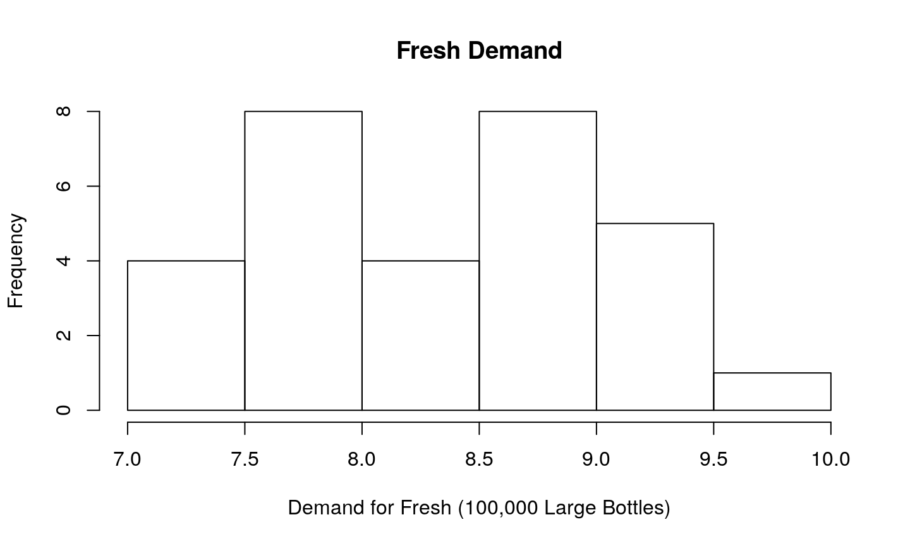


## Enterprise Industries: Fresh Detergent

Enterprise Industries, owners of Fresh Detergent, want to predict demand for their product.
In this case, the product is an extra large bottle of Fresh liquid detergent.
Given a model for demand, Enterprise can:

* Plan a production schedule
* Estimate production requirements
* Plan inventory requirements
* Estimate sales revenue (and profits?)


## The Data to Work With

Four indicators for 30 sales periods (4 weeks):

- The demand for the extra large sized bottle of Fresh (in 100,000s of bottles) in a sales period
- The price of Fresh in the sales period (in dollars)
- The average competitor price for similar products in the sales period (in dollars)
- Enterprise Industries' advertising expenditures (in \$100,000s) targeted toward Fresh in the sales period.
- Later we might incorporate data on the advertising campaigns.

## Data


```
##    Fresh.Demand Fresh.Price Industry.Price Advertising.Spending
## 1          7.38        3.85           3.80                 5.50
## 2          8.51        3.75           4.00                 6.75
## 3          9.52        3.70           4.30                 7.25
## 4          7.50        3.70           3.70                 5.50
## 5          9.33        3.60           3.85                 7.00
## 6          8.28        3.60           3.80                 6.50
## 7          8.75        3.60           3.75                 6.75
## 8          7.87        3.80           3.85                 5.25
## 9          7.10        3.80           3.65                 5.25
## 10         8.00        3.85           4.00                 6.00
## 11         7.89        3.90           4.10                 6.50
## 12         8.15        3.90           4.00                 6.25
## 13         9.10        3.70           4.10                 7.00
## 14         8.86        3.75           4.20                 6.90
## 15         8.90        3.75           4.10                 6.80
## 16         8.87        3.80           4.10                 6.80
## 17         9.26        3.70           4.20                 7.10
## 18         9.00        3.80           4.30                 7.00
## 19         8.75        3.70           4.10                 6.80
## 20         7.95        3.80           3.75                 6.50
```

## Summaries

<!-- html table generated in R 3.6.1 by xtable 1.8-4 package -->
<!-- Mon Nov 18 15:43:08 2019 -->
<table border=1>
<tr> <th>  </th> <th> Mean </th> <th> Std. Dev. </th> <th> Minimum </th> <th> Maximum </th> <th> Atoms </th>  </tr>
  <tr> <td align="right"> Fresh.Demand </td> <td align="right"> 8.38 </td> <td align="right"> 0.68 </td> <td align="right"> 7.10 </td> <td align="right"> 9.52 </td> <td align="right"> 26.00 </td> </tr>
  <tr> <td align="right"> Fresh.Price </td> <td align="right"> 3.73 </td> <td align="right"> 0.09 </td> <td align="right"> 3.55 </td> <td align="right"> 3.90 </td> <td align="right"> 8.00 </td> </tr>
  <tr> <td align="right"> Industry.Price </td> <td align="right"> 3.95 </td> <td align="right"> 0.22 </td> <td align="right"> 3.65 </td> <td align="right"> 4.30 </td> <td align="right"> 11.00 </td> </tr>
  <tr> <td align="right"> Advertising.Spending </td> <td align="right"> 6.45 </td> <td align="right"> 0.57 </td> <td align="right"> 5.25 </td> <td align="right"> 7.25 </td> <td align="right"> 13.00 </td> </tr>
   </table>
<!-- html table generated in R 3.6.1 by xtable 1.8-4 package -->
<!-- Mon Nov 18 15:43:08 2019 -->
<table border=1>
<tr> <th>  </th> <th> Fresh.Demand </th> <th> Fresh.Price </th> <th> Industry.Price </th> <th> Advertising.Spending </th>  </tr>
  <tr> <td align="right"> Fresh.Demand </td> <td align="right"> 1.00 </td> <td align="right"> -0.47 </td> <td align="right"> 0.74 </td> <td align="right"> 0.88 </td> </tr>
  <tr> <td align="right"> Fresh.Price </td> <td align="right"> -0.47 </td> <td align="right"> 1.00 </td> <td align="right"> 0.08 </td> <td align="right"> -0.47 </td> </tr>
  <tr> <td align="right"> Industry.Price </td> <td align="right"> 0.74 </td> <td align="right"> 0.08 </td> <td align="right"> 1.00 </td> <td align="right"> 0.60 </td> </tr>
  <tr> <td align="right"> Advertising.Spending </td> <td align="right"> 0.88 </td> <td align="right"> -0.47 </td> <td align="right"> 0.60 </td> <td align="right"> 1.00 </td> </tr>
   </table>

## How does Fresh Compare?

Is the Industry More or Less Expensive?  
**This is industry minus fresh.**


```r
# Is the Industry More or Less Expensive?  This is industry minus fresh.  
t.test(fresh.data$Price.Difference)
```

```
## 
## 	One Sample t-test
## 
## data:  fresh.data$Price.Difference
## t = 5.1383, df = 29, p-value = 1.727e-05
## alternative hypothesis: true mean is not equal to 0
## 95 percent confidence interval:
##  0.1284192 0.2982474
## sample estimates:
## mean of x 
## 0.2133333
```

Yes, Fresh is $0.13 to $0.30 cheaper.

# A Base Visualization


```r
library(patchwork)
fresh.data$obs <- seq(1:30)
ggplot(fresh.data) + aes(x=obs) + geom_line(aes(y=Fresh.Price), color = "blue", alpha = 0.2) + geom_line(aes(y=Industry.Price), color = "red", alpha = 0.2) + labs(title="Prices", x = "Period", y="Fresh/Blue Industry/Red") + ggplot(fresh.data, aes(x=obs, y=Price.Difference)) + geom_line() + labs(title="Price Differences", x = "Period")
```


## Some Simple Graphics

- Prices act as we might expect.
- Own Price and Industry Price appear to work opposing.
- Advertising Spending could be a line or a non-line.

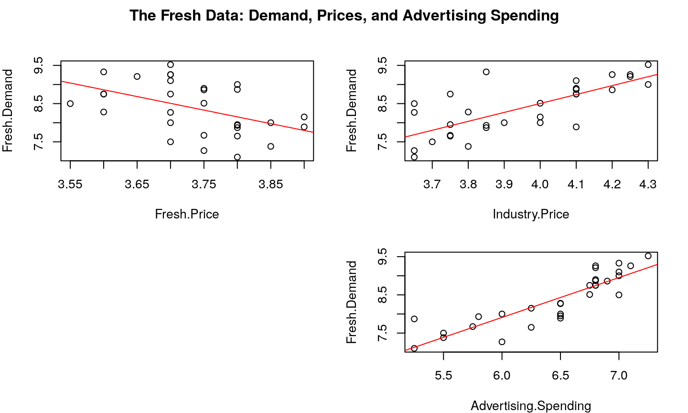

## Three Dimensions

Let's have a look at the 3-D.

## Code

`Requires(rgl)`  Warnings apply.

```
plot3d(z=fresh.data$Fresh.Demand, y=fresh.data$Advertising.Spending, x=fresh.data$Price.Difference, surface=FALSE, residuals=TRUE, bg="white", 
  axis.scales=TRUE, grid=TRUE, ellipsoid=FALSE)
```

## Plotly

<!--html_preserve--><div id="htmlwidget-d4400b1b958be52e585d" style="width:720px;height:432px;" class="plotly html-widget"></div>
<script type="application/json" data-for="htmlwidget-d4400b1b958be52e585d">{"x":{"visdat":{"15b96df7471c":["function () ","plotlyVisDat"]},"cur_data":"15b96df7471c","attrs":{"15b96df7471c":{"x":{},"y":{},"text":{},"mode":"markers","marker":{"sizemode":"diameter","opacity":0.7},"color":{},"size":{},"colors":"Reds","alpha_stroke":1,"sizes":[10,50],"spans":[1,20],"type":"scatter"}},"layout":{"margin":{"b":40,"l":60,"t":25,"r":10},"title":"Demand for Fresh","xaxis":{"domain":[0,1],"automargin":true,"title":"Price.Difference"},"yaxis":{"domain":[0,1],"automargin":true,"title":"Advertising.Spending"},"hovermode":"closest","showlegend":false,"legend":{"yanchor":"top","y":0.5}},"source":"A","config":{"showSendToCloud":false},"data":[{"x":[-0.0500000007450581,0.25,0.600000023841858,0,0.25,0.200000002980232,0.150000005960464,0.0500000007450581,-0.150000005960464,0.150000005960464,0.200000002980232,0.100000001490116,0.400000005960464,0.449999988079071,0.349999994039536,0.300000011920929,0.5,0.5,0.400000005960464,-0.0500000007450581,-0.0500000007450581,-0.100000001490116,0.200000002980232,0.100000001490116,0.5,0.600000023841858,-0.0500000007450581,0,0.0500000007450581,0.550000011920929],"y":[5.5,6.75,7.25,5.5,7,6.5,6.75,5.25,5.25,6,6.5,6.25,7,6.90000009536743,6.80000019073486,6.80000019073486,7.09999990463257,7,6.80000019073486,6.5,6.25,6,6.5,7,6.80000019073486,6.80000019073486,6.5,5.75,5.80000019073486,6.80000019073486],"text":[7.38000011444092,8.51000022888184,9.52000045776367,7.5,9.32999992370605,8.27999973297119,8.75,7.86999988555908,7.09999990463257,8,7.8899998664856,8.14999961853027,9.10000038146973,8.85999965667725,8.89999961853027,8.86999988555908,9.26000022888184,9,8.75,7.94999980926514,7.65000009536743,7.26999998092651,8,8.5,8.75,9.21000003814697,8.27000045776367,7.67000007629395,7.92999982833862,9.26000022888184],"mode":"markers","marker":{"colorbar":{"title":"Fresh.Demand","ticklen":2},"cmin":7.09999990463257,"cmax":9.52000045776367,"colorscale":[["0","rgba(255,245,240,1)"],["0.0416666666666667","rgba(255,238,230,1)"],["0.0833333333333335","rgba(255,231,220,1)"],["0.125","rgba(254,224,210,1)"],["0.166666666666667","rgba(254,212,193,1)"],["0.208333333333333","rgba(253,199,177,1)"],["0.25","rgba(252,187,161,1)"],["0.291666666666667","rgba(253,174,145,1)"],["0.333333333333333","rgba(253,160,129,1)"],["0.375","rgba(252,146,114,1)"],["0.416666666666667","rgba(252,133,101,1)"],["0.458333333333333","rgba(252,120,87,1)"],["0.5","rgba(251,106,74,1)"],["0.541666666666667","rgba(247,92,64,1)"],["0.583333333333333","rgba(243,77,54,1)"],["0.625","rgba(239,59,44,1)"],["0.666666666666667","rgba(227,49,39,1)"],["0.708333333333334","rgba(215,37,34,1)"],["0.75","rgba(203,24,29,1)"],["0.791666666666666","rgba(190,21,26,1)"],["0.833333333333333","rgba(178,18,24,1)"],["0.875","rgba(165,15,21,1)"],["0.916666666666667","rgba(144,9,19,1)"],["0.958333333333333","rgba(123,3,16,1)"],["1","rgba(103,0,13,1)"]],"showscale":false,"color":[7.38000011444092,8.51000022888184,9.52000045776367,7.5,9.32999992370605,8.27999973297119,8.75,7.86999988555908,7.09999990463257,8,7.8899998664856,8.14999961853027,9.10000038146973,8.85999965667725,8.89999961853027,8.86999988555908,9.26000022888184,9,8.75,7.94999980926514,7.65000009536743,7.26999998092651,8,8.5,8.75,9.21000003814697,8.27000045776367,7.67000007629395,7.92999982833862,9.26000022888184],"size":[14.628101583631,33.3057851565356,50,16.6115703130711,46.8594960226469,29.5041249360358,37.2727226154158,22.7272695029801,10,24.876031234009,23.0578476245535,27.355363205007,43.0578515653556,39.0908983432672,39.7520545864138,39.2561913448558,45.7024765379424,41.4049530758847,37.2727226154158,24.0495819892736,19.0909101656732,12.8099179741754,24.876031234009,33.1404921549468,37.2727226154158,44.8760272932069,29.3388476976553,19.4214882872467,23.7190038677001,45.7024765379424],"sizemode":"diameter","opacity":0.7,"line":{"colorbar":{"title":"","ticklen":2},"cmin":7.09999990463257,"cmax":9.52000045776367,"colorscale":[["0","rgba(255,245,240,1)"],["0.0416666666666667","rgba(255,238,230,1)"],["0.0833333333333335","rgba(255,231,220,1)"],["0.125","rgba(254,224,210,1)"],["0.166666666666667","rgba(254,212,193,1)"],["0.208333333333333","rgba(253,199,177,1)"],["0.25","rgba(252,187,161,1)"],["0.291666666666667","rgba(253,174,145,1)"],["0.333333333333333","rgba(253,160,129,1)"],["0.375","rgba(252,146,114,1)"],["0.416666666666667","rgba(252,133,101,1)"],["0.458333333333333","rgba(252,120,87,1)"],["0.5","rgba(251,106,74,1)"],["0.541666666666667","rgba(247,92,64,1)"],["0.583333333333333","rgba(243,77,54,1)"],["0.625","rgba(239,59,44,1)"],["0.666666666666667","rgba(227,49,39,1)"],["0.708333333333334","rgba(215,37,34,1)"],["0.75","rgba(203,24,29,1)"],["0.791666666666666","rgba(190,21,26,1)"],["0.833333333333333","rgba(178,18,24,1)"],["0.875","rgba(165,15,21,1)"],["0.916666666666667","rgba(144,9,19,1)"],["0.958333333333333","rgba(123,3,16,1)"],["1","rgba(103,0,13,1)"]],"showscale":false,"color":[7.38000011444092,8.51000022888184,9.52000045776367,7.5,9.32999992370605,8.27999973297119,8.75,7.86999988555908,7.09999990463257,8,7.8899998664856,8.14999961853027,9.10000038146973,8.85999965667725,8.89999961853027,8.86999988555908,9.26000022888184,9,8.75,7.94999980926514,7.65000009536743,7.26999998092651,8,8.5,8.75,9.21000003814697,8.27000045776367,7.67000007629395,7.92999982833862,9.26000022888184]}},"type":"scatter","textfont":{"size":[14.628101583631,33.3057851565356,50,16.6115703130711,46.8594960226469,29.5041249360358,37.2727226154158,22.7272695029801,10,24.876031234009,23.0578476245535,27.355363205007,43.0578515653556,39.0908983432672,39.7520545864138,39.2561913448558,45.7024765379424,41.4049530758847,37.2727226154158,24.0495819892736,19.0909101656732,12.8099179741754,24.876031234009,33.1404921549468,37.2727226154158,44.8760272932069,29.3388476976553,19.4214882872467,23.7190038677001,45.7024765379424]},"error_y":{"width":[]},"error_x":{"width":[]},"xaxis":"x","yaxis":"y","frame":null},{"x":[-0.150000005960464,0.600000023841858],"y":[5.25,7.25],"type":"scatter","mode":"markers","opacity":0,"hoverinfo":"none","showlegend":false,"marker":{"colorbar":{"title":"Fresh.Demand","ticklen":2,"len":0.5,"lenmode":"fraction","y":1,"yanchor":"top"},"cmin":7.09999990463257,"cmax":9.52000045776367,"colorscale":[["0","rgba(255,245,240,1)"],["0.0416666666666667","rgba(255,238,230,1)"],["0.0833333333333335","rgba(255,231,220,1)"],["0.125","rgba(254,224,210,1)"],["0.166666666666667","rgba(254,212,193,1)"],["0.208333333333333","rgba(253,199,177,1)"],["0.25","rgba(252,187,161,1)"],["0.291666666666667","rgba(253,174,145,1)"],["0.333333333333333","rgba(253,160,129,1)"],["0.375","rgba(252,146,114,1)"],["0.416666666666667","rgba(252,133,101,1)"],["0.458333333333333","rgba(252,120,87,1)"],["0.5","rgba(251,106,74,1)"],["0.541666666666667","rgba(247,92,64,1)"],["0.583333333333333","rgba(243,77,54,1)"],["0.625","rgba(239,59,44,1)"],["0.666666666666667","rgba(227,49,39,1)"],["0.708333333333334","rgba(215,37,34,1)"],["0.75","rgba(203,24,29,1)"],["0.791666666666666","rgba(190,21,26,1)"],["0.833333333333333","rgba(178,18,24,1)"],["0.875","rgba(165,15,21,1)"],["0.916666666666667","rgba(144,9,19,1)"],["0.958333333333333","rgba(123,3,16,1)"],["1","rgba(103,0,13,1)"]],"showscale":true,"color":[7.09999990463257,9.52000045776367],"line":{"color":"rgba(255,127,14,1)"}},"xaxis":"x","yaxis":"y","frame":null}],"highlight":{"on":"plotly_click","persistent":false,"dynamic":false,"selectize":false,"opacityDim":0.2,"selected":{"opacity":1},"debounce":0},"shinyEvents":["plotly_hover","plotly_click","plotly_selected","plotly_relayout","plotly_brushed","plotly_brushing","plotly_clickannotation","plotly_doubleclick","plotly_deselect","plotly_afterplot"],"base_url":"https://plot.ly"},"evals":[],"jsHooks":[]}</script><!--/html_preserve-->


## Naive Regession Model


<table style="text-align:center"><tr><td colspan="2" style="border-bottom: 1px solid black"></td></tr><tr><td style="text-align:left"></td><td><em>Dependent variable:</em></td></tr>
<tr><td></td><td colspan="1" style="border-bottom: 1px solid black"></td></tr>
<tr><td style="text-align:left"></td><td>Fresh.Demand</td></tr>
<tr><td colspan="2" style="border-bottom: 1px solid black"></td></tr><tr><td style="text-align:left">Fresh.Price</td><td>-2.358<sup>***</sup></td></tr>
<tr><td style="text-align:left"></td><td>(0.638)</td></tr>
<tr><td style="text-align:left"></td><td></td></tr>
<tr><td style="text-align:left">Industry.Price</td><td>1.612<sup>***</sup></td></tr>
<tr><td style="text-align:left"></td><td>(0.295)</td></tr>
<tr><td style="text-align:left"></td><td></td></tr>
<tr><td style="text-align:left">Advertising.Spending</td><td>0.501<sup>***</sup></td></tr>
<tr><td style="text-align:left"></td><td>(0.126)</td></tr>
<tr><td style="text-align:left"></td><td></td></tr>
<tr><td style="text-align:left">Constant</td><td>7.589<sup>***</sup></td></tr>
<tr><td style="text-align:left"></td><td>(2.445)</td></tr>
<tr><td style="text-align:left"></td><td></td></tr>
<tr><td colspan="2" style="border-bottom: 1px solid black"></td></tr><tr><td style="text-align:left">Observations</td><td>30</td></tr>
<tr><td style="text-align:left">R<sup>2</sup></td><td>0.894</td></tr>
<tr><td style="text-align:left">Adjusted R<sup>2</sup></td><td>0.881</td></tr>
<tr><td style="text-align:left">Residual Std. Error</td><td>0.235 (df = 26)</td></tr>
<tr><td style="text-align:left">F Statistic</td><td>72.797<sup>***</sup> (df = 3; 26)</td></tr>
<tr><td colspan="2" style="border-bottom: 1px solid black"></td></tr><tr><td style="text-align:left"><em>Note:</em></td><td style="text-align:right"><sup>*</sup>p<0.1; <sup>**</sup>p<0.05; <sup>***</sup>p<0.01</td></tr>
</table>

## Interpretation

Conforms to intuition:

+ Demand is inversely related to own price. 
+ Demand is positively related to industry price. 
+ Advertising enhances demand.

## Intervals

Constructing na\"ive confidence intervals: 

+ Own price and industry price may cancel out. 
+ -2.36 $\pm t_{.975, 30-4}$*0.64={-1.04,-3.68}
+ 1.61 $\pm t_{.025, 30-4}$*0.30={0.99,2.23}. 

How could we test this?

## Testing

+ We can either test a negative equality constraint ($\beta_{1} = -\beta_{2}$) or estimate a single parameter for a variable measuring the price difference. 
- The former imposes a constraint. 
- The latter involves a simple manipulation of the data.  $Fresh.Price - Industry.Price$  and then compare the two models. $$ y_{t} = \beta_{0} + \beta^{*}_{D}(F.P._{t} - I.P._{t}) + \beta_{3}Ad.Spend_{t} + \epsilon_{t} $$

## Result


<table style="text-align:center"><tr><td colspan="3" style="border-bottom: 1px solid black"></td></tr><tr><td style="text-align:left"></td><td colspan="2"><em>Dependent variable:</em></td></tr>
<tr><td></td><td colspan="2" style="border-bottom: 1px solid black"></td></tr>
<tr><td style="text-align:left"></td><td colspan="2">Fresh.Demand</td></tr>
<tr><td style="text-align:left"></td><td>(1)</td><td>(2)</td></tr>
<tr><td colspan="3" style="border-bottom: 1px solid black"></td></tr><tr><td style="text-align:left">Fresh.Price</td><td>-2.358<sup>***</sup></td><td></td></tr>
<tr><td style="text-align:left"></td><td>(0.638)</td><td></td></tr>
<tr><td style="text-align:left"></td><td></td><td></td></tr>
<tr><td style="text-align:left">Industry.Price</td><td>1.612<sup>***</sup></td><td></td></tr>
<tr><td style="text-align:left"></td><td>(0.295)</td><td></td></tr>
<tr><td style="text-align:left"></td><td></td><td></td></tr>
<tr><td style="text-align:left">Price.Difference</td><td></td><td>1.588<sup>***</sup></td></tr>
<tr><td style="text-align:left"></td><td></td><td>(0.299)</td></tr>
<tr><td style="text-align:left"></td><td></td><td></td></tr>
<tr><td style="text-align:left">Advertising.Spending</td><td>0.501<sup>***</sup></td><td>0.563<sup>***</sup></td></tr>
<tr><td style="text-align:left"></td><td>(0.126)</td><td>(0.119)</td></tr>
<tr><td style="text-align:left"></td><td></td><td></td></tr>
<tr><td style="text-align:left">Constant</td><td>7.589<sup>***</sup></td><td>4.407<sup>***</sup></td></tr>
<tr><td style="text-align:left"></td><td>(2.445)</td><td>(0.722)</td></tr>
<tr><td style="text-align:left"></td><td></td><td></td></tr>
<tr><td colspan="3" style="border-bottom: 1px solid black"></td></tr><tr><td style="text-align:left">Observations</td><td>30</td><td>30</td></tr>
<tr><td style="text-align:left">R<sup>2</sup></td><td>0.894</td><td>0.886</td></tr>
<tr><td style="text-align:left">Adjusted R<sup>2</sup></td><td>0.881</td><td>0.878</td></tr>
<tr><td style="text-align:left">Residual Std. Error</td><td>0.235 (df = 26)</td><td>0.238 (df = 27)</td></tr>
<tr><td style="text-align:left">F Statistic</td><td>72.797<sup>***</sup> (df = 3; 26)</td><td>104.967<sup>***</sup> (df = 2; 27)</td></tr>
<tr><td colspan="3" style="border-bottom: 1px solid black"></td></tr><tr><td style="text-align:left"><em>Note:</em></td><td colspan="2" style="text-align:right"><sup>*</sup>p<0.1; <sup>**</sup>p<0.05; <sup>***</sup>p<0.01</td></tr>
</table>
<!-- html table generated in R 3.6.1 by xtable 1.8-4 package -->
<!-- Mon Nov 18 15:43:09 2019 -->
<table border=1>
<tr> <th>  </th> <th> Res.Df </th> <th> RSS </th> <th> Df </th> <th> Sum of Sq </th> <th> F </th> <th> Pr(&gt;F) </th>  </tr>
  <tr> <td> 1 </td> <td align="right"> 27 </td> <td align="right"> 1.53 </td> <td align="right">  </td> <td align="right">  </td> <td align="right">  </td> <td align="right">  </td> </tr>
  <tr> <td> 2 </td> <td align="right"> 26 </td> <td align="right"> 1.43 </td> <td align="right"> 1 </td> <td align="right"> 0.10 </td> <td align="right"> 1.85 </td> <td align="right"> 0.1855 </td> </tr>
   </table>

## Recreating F

Let's solve for F in terms of r-squared.

- What is the difference in r-squared across the two models?  
0.007569.

- What is the average unexplained variance for the biggest model?
0.0043829

- Which yields the following F.
1.8497987 

## Difference in Predictions?

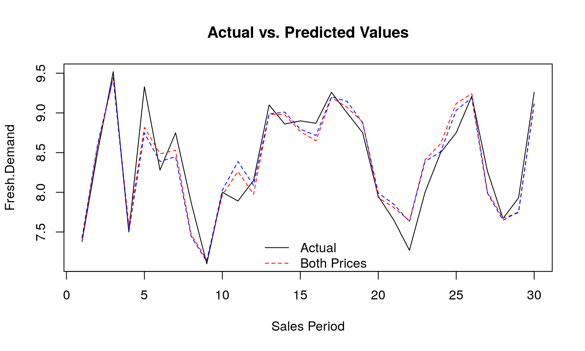

## Basic Scatterplots Revisited

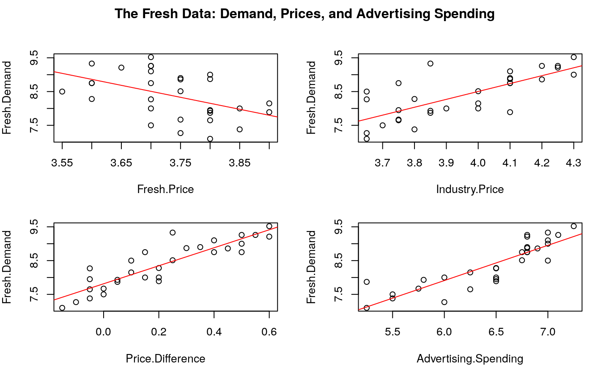


## Functional Forms

- Though we call it a linear model, the important part about linear is **linear coefficients**.
- Transformations of data make it possible to incorporate non-linear functions.  *John von Neumann once equated the class of non-linear functions to the class of non-elephant animals.*
- Caution with overfitting and creating inexplicable functional forms should remain in our minds.  There is a widely employed **saturated** model that fits the data perfectly (with exactly as many parameters as data points).

## How should we use the information?

- We expect demand to be determined by price and by information.
- How should we use the information that we have?
   + Relevant characteristics of price(s)
   + What is the effect of advertising spending and what do we think it should be?
- For this demand problem, the difference in prices seems sufficient.
- For this demand problem, advertising expenditures may be subject to nonconstant marginal returns.


## Exploring Advertising Spending


## How are Prices and Ads Related?


```r
ggplot(fresh.data, aes(y=Advertising.Spending, x=Price.Difference, size=Fresh.Demand)) + 
  geom_point() + 
  labs(title="The Explainers") 
```

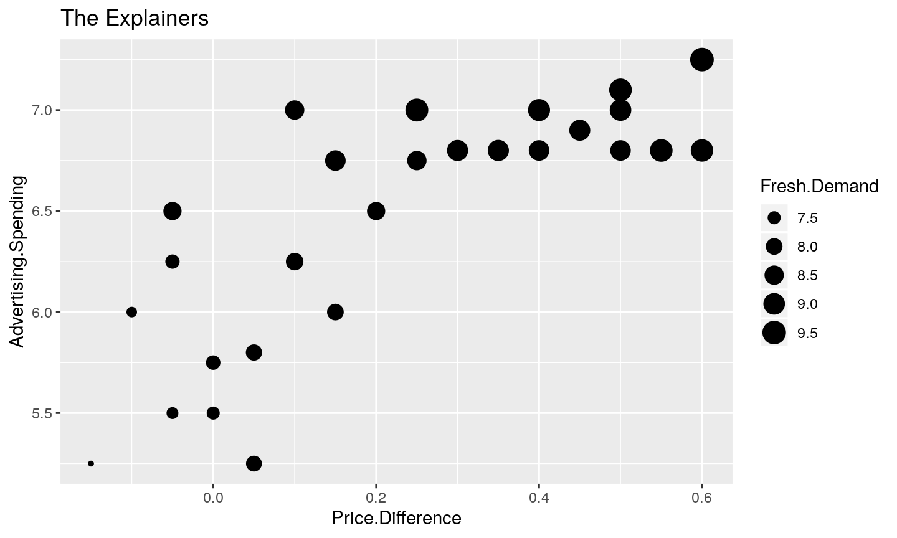


## Non-linear fitting

- A line struggles with the points on the right of the graphic.  
- A quadratic term in Advertising.Spending may be justified given non-constant returns.  
- We can incorporate this with a model written as, $$ y_{t} = \beta_{0} + \beta^{*}_{D}\textrm{Price.Diff.}_{t} + \beta_{3}\textrm{Ad.Spending}_{t} + \beta_{4}\textrm{Ad.Spending}_{t}^{2} + \epsilon_{t} $$
- This doesn't violate any assumptions of the regression model as the square is a non-linear transformation.

## Tables


<table style="text-align:center"><tr><td colspan="4" style="border-bottom: 1px solid black"></td></tr><tr><td style="text-align:left"></td><td colspan="3"><em>Dependent variable:</em></td></tr>
<tr><td></td><td colspan="3" style="border-bottom: 1px solid black"></td></tr>
<tr><td style="text-align:left"></td><td colspan="3">Fresh.Demand</td></tr>
<tr><td style="text-align:left"></td><td>(1)</td><td>(2)</td><td>(3)</td></tr>
<tr><td colspan="4" style="border-bottom: 1px solid black"></td></tr><tr><td style="text-align:left">Fresh.Price</td><td>-2.358<sup>***</sup></td><td></td><td></td></tr>
<tr><td style="text-align:left"></td><td>(0.638)</td><td></td><td></td></tr>
<tr><td style="text-align:left"></td><td></td><td></td><td></td></tr>
<tr><td style="text-align:left">Industry.Price</td><td>1.612<sup>***</sup></td><td></td><td></td></tr>
<tr><td style="text-align:left"></td><td>(0.295)</td><td></td><td></td></tr>
<tr><td style="text-align:left"></td><td></td><td></td><td></td></tr>
<tr><td style="text-align:left">Price.Difference</td><td></td><td>1.588<sup>***</sup></td><td>1.307<sup>***</sup></td></tr>
<tr><td style="text-align:left"></td><td></td><td>(0.299)</td><td>(0.304)</td></tr>
<tr><td style="text-align:left"></td><td></td><td></td><td></td></tr>
<tr><td style="text-align:left">Advertising.Spending</td><td>0.501<sup>***</sup></td><td>0.563<sup>***</sup></td><td>-3.696<sup>*</sup></td></tr>
<tr><td style="text-align:left"></td><td>(0.126)</td><td>(0.119)</td><td>(1.850)</td></tr>
<tr><td style="text-align:left"></td><td></td><td></td><td></td></tr>
<tr><td style="text-align:left">I(Advertising.Spending2)</td><td></td><td></td><td>0.349<sup>**</sup></td></tr>
<tr><td style="text-align:left"></td><td></td><td></td><td>(0.151)</td></tr>
<tr><td style="text-align:left"></td><td></td><td></td><td></td></tr>
<tr><td style="text-align:left">Constant</td><td>7.589<sup>***</sup></td><td>4.407<sup>***</sup></td><td>17.324<sup>***</sup></td></tr>
<tr><td style="text-align:left"></td><td>(2.445)</td><td>(0.722)</td><td>(5.641)</td></tr>
<tr><td style="text-align:left"></td><td></td><td></td><td></td></tr>
<tr><td colspan="4" style="border-bottom: 1px solid black"></td></tr><tr><td style="text-align:left">Observations</td><td>30</td><td>30</td><td>30</td></tr>
<tr><td style="text-align:left">R<sup>2</sup></td><td>0.894</td><td>0.886</td><td>0.905</td></tr>
<tr><td style="text-align:left">Adjusted R<sup>2</sup></td><td>0.881</td><td>0.878</td><td>0.894</td></tr>
<tr><td style="text-align:left">Residual Std. Error</td><td>0.235 (df = 26)</td><td>0.238 (df = 27)</td><td>0.221 (df = 26)</td></tr>
<tr><td style="text-align:left">F Statistic</td><td>72.797<sup>***</sup> (df = 3; 26)</td><td>104.967<sup>***</sup> (df = 2; 27)</td><td>82.941<sup>***</sup> (df = 3; 26)</td></tr>
<tr><td colspan="4" style="border-bottom: 1px solid black"></td></tr><tr><td style="text-align:left"><em>Note:</em></td><td colspan="3" style="text-align:right"><sup>*</sup>p<0.1; <sup>**</sup>p<0.05; <sup>***</sup>p<0.01</td></tr>
</table>

## What does the model say?

- All else equal, the price difference effect changes a little 
- Before, a \$0.10 price differential in favor of fresh implied 15,900 more sales [\$(1.59x0.1)100,000$] 
- Now the effect is about 13,100 [$(1.31x0.1)x100,000$].

## Model Comparisons
- Does *Advertising.Spending* have an effect?  Test the hypothesis that both the linear term and the squared term are jointly zero against the alternative that at least one is not. $F = \frac{\frac{2.8059-1.2733}{(3-1)}}{\frac{1.2733}{26}} = 15.65$.
- From the standpoint of model comparison, the regression $F$ statistic does not reject the inclusion of the quadratic term, $F^{E}=t^{2}=5.3176, Pr(F^{E} > F)=0.02934$.
- All else equal, as Advertising.Spending increases, sales increase at an increasing rate.  Let's look at a picture of the effect. 
- We could use the tools of calculus to figure this out.  Simply take $\frac{\partial \hat{y}}{\partial \textrm{Ad. Spending}} = -3.6956 + 0.3486*2*\textrm{Ad.Spending}$.  If we set it equal to zero and solve, we get that the effect switches from negative to positive when Ad.Spending is greater than 5.30 [$100,000].


## The Picture

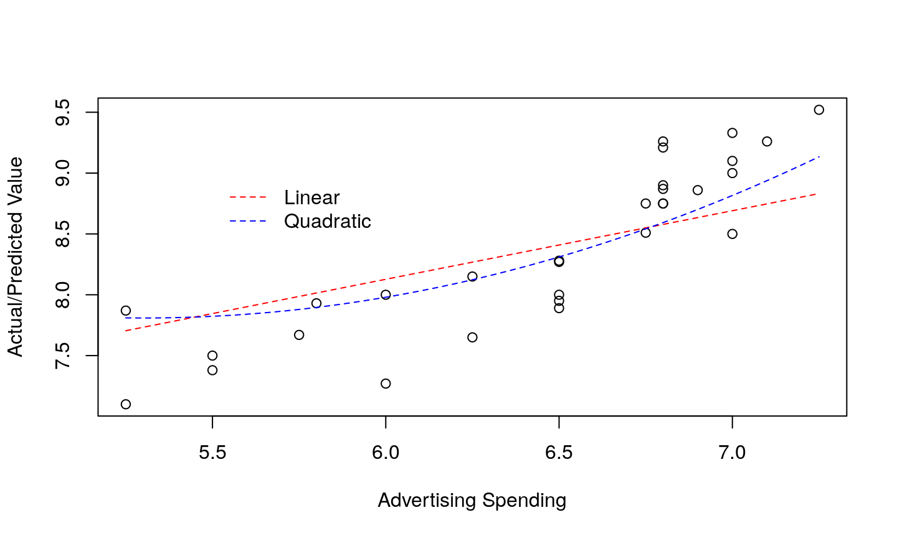

## The Effect of a Quadratic on the Regression Plane

- Instead of a constant slope plane for the regression, we have a non-linear function on one dimension.  
- what remains are (partial) lines, we are simply shifting this non-linear function. 
- Let's have a look at the plane implied by this addition to our case.

## The Plane

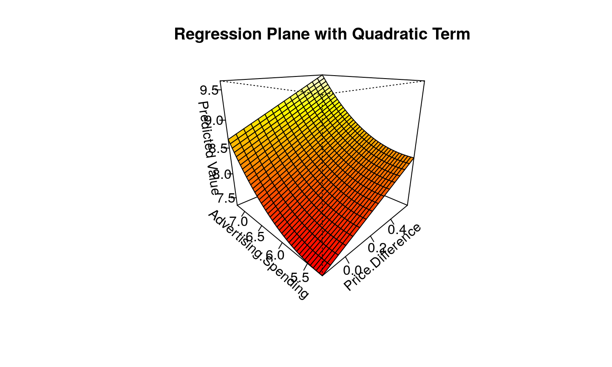

## Some Residual Diagnostics

- The key model diagnostics suggest a reasonable fit and relevant predictors.
- That is not all that we want to justify inference.
- Examine key assumptions that undergird the linear model before supplying Enterprise with their forecast.


## The Forecasts

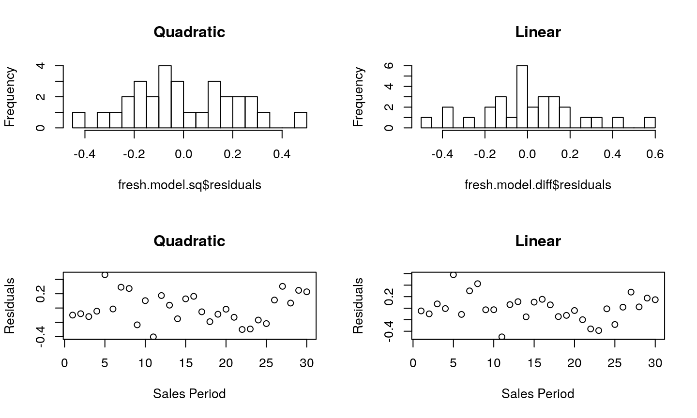

## Normal Residuals?

```r
par(mfrow=c(2,2))
qqnorm(fresh.model.diff$residuals, main="QQ-Normal: Linear Ad.Spending", datax=TRUE)
qqnorm(fresh.model.sq$residuals, main="QQ-Normal: Quadratic Ad.Spending", datax=TRUE)
plot(fresh.data$Price.Difference,fresh.model.sq$residuals, xlab="Price.Difference")
plot(fresh.data$Price.Difference,fresh.model.diff$residuals, xlab="Price.Difference")
```

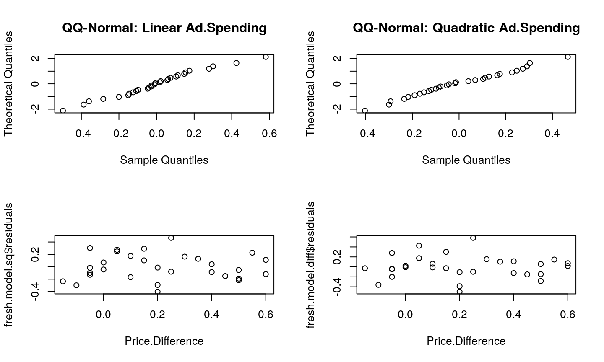

## Residual Plots


## Putting Together the Forecast
Once we decide on a model, we can come up with at least two very valuable quantities.

- The upper bound of the prediction interval [Recall that the prediction interval is $$ \hat{y} \pm t_{\frac{\alpha}{2}}s\sqrt{1 + \frac{1}{n} + \frac{(x_{0} - \overline{x})^{2}}{SS_{xx}}}$$] can be used to bound necessary inventory.
- The lower bound of the prediction interval can be used to bound a revenue forecast.

Let's characterize the \emph{real decision problem} in choosing among these models.

## Picture

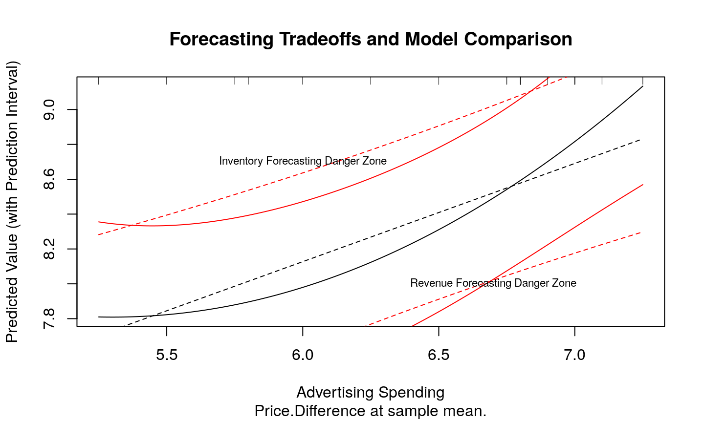


## Picture 2

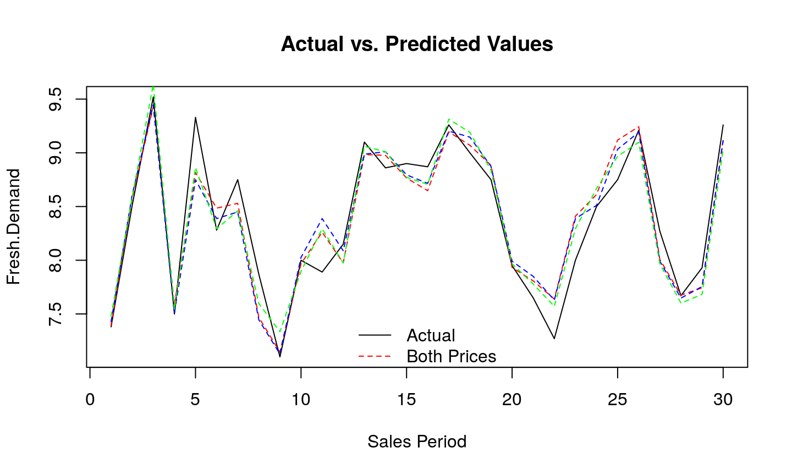

## What Warnings?

- It seems reasonable to expect a further kink in the right of the Advertising Spending graphic were Advertising Spending to increase further. **The marginal dollar cannot reasonably be thought to imply such returns.** 
- The general problem this raises is **extrapolation**. 
- How do we predict outcomes that are outside of the realm of things we have observed? 
- More generally, this is where fitting functions to data and being able to generalize functions come to sharp disagreement.

## Scaling Regression

We will take regression models in three directions.  

+ Richening the set of $X$ with more and more variation in the types of predictors.  This will require paying attention the interrelationships among elements of $X$.  

+ Automating `feature selection` using defined criteria.

+ Expanding the data types we model as outcome to binary choices.

