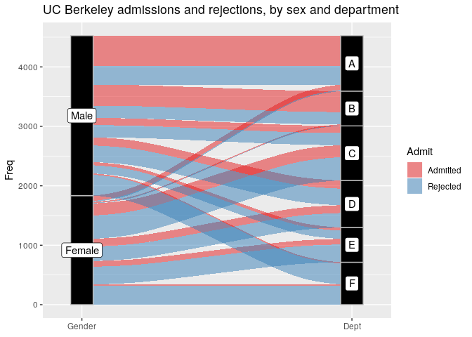
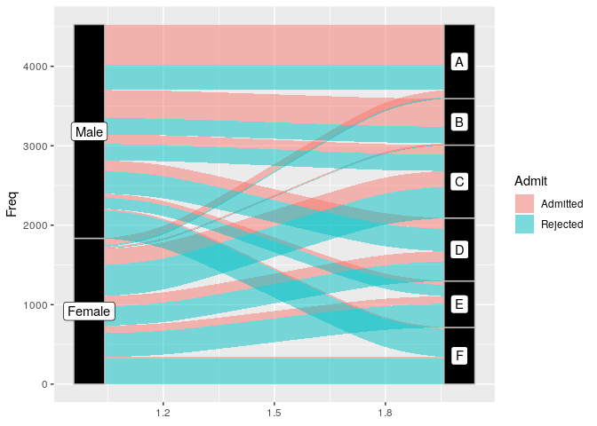
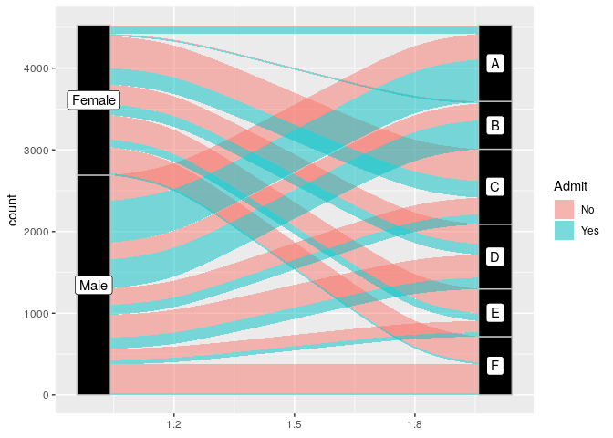

## Alluvial and Sankey Diagrams

The aforementioned plots are methods for visualising the flow of data through a stream of markers.  I was motivated to show this because enough of you deal in orders, tickets, and the like the flow visualisation of a system might prove of use.  I will work with a familiar dataset.  These are data on Admissions at the University of California Berkeley.  The data exist as an internal R file in tabular form.


```r
library(tidyverse)
```

```
## ── Attaching packages ─────────────────────────────────────────────────────────────────────────────────────────────────── tidyverse 1.2.1 ──
```

```
## ✔ ggplot2 3.1.1       ✔ purrr   0.3.2  
## ✔ tibble  2.1.1       ✔ dplyr   0.8.0.1
## ✔ tidyr   0.8.3       ✔ stringr 1.4.0  
## ✔ readr   1.3.1       ✔ forcats 0.4.0
```

```
## ── Conflicts ────────────────────────────────────────────────────────────────────────────────────────────────────── tidyverse_conflicts() ──
## ✖ dplyr::filter() masks stats::filter()
## ✖ dplyr::lag()    masks stats::lag()
```

```r
library(ggalluvial) # if this is not installed, install.packages("ggalluvial")
data("UCBAdmissions") # This dataset is built in as a set of tables.
UCBAdmissions  # What does it look like?
```

```
## , , Dept = A
## 
##           Gender
## Admit      Male Female
##   Admitted  512     89
##   Rejected  313     19
## 
## , , Dept = B
## 
##           Gender
## Admit      Male Female
##   Admitted  353     17
##   Rejected  207      8
## 
## , , Dept = C
## 
##           Gender
## Admit      Male Female
##   Admitted  120    202
##   Rejected  205    391
## 
## , , Dept = D
## 
##           Gender
## Admit      Male Female
##   Admitted  138    131
##   Rejected  279    244
## 
## , , Dept = E
## 
##           Gender
## Admit      Male Female
##   Admitted   53     94
##   Rejected  138    299
## 
## , , Dept = F
## 
##           Gender
## Admit      Male Female
##   Admitted   22     24
##   Rejected  351    317
```

```r
UCBADF <- data.frame(UCBAdmissions)  # For it into a data.frame
UCBADF  # This is what the data structure needs to look like.
```

```
##       Admit Gender Dept Freq
## 1  Admitted   Male    A  512
## 2  Rejected   Male    A  313
## 3  Admitted Female    A   89
## 4  Rejected Female    A   19
## 5  Admitted   Male    B  353
## 6  Rejected   Male    B  207
## 7  Admitted Female    B   17
## 8  Rejected Female    B    8
## 9  Admitted   Male    C  120
## 10 Rejected   Male    C  205
## 11 Admitted Female    C  202
## 12 Rejected Female    C  391
## 13 Admitted   Male    D  138
## 14 Rejected   Male    D  279
## 15 Admitted Female    D  131
## 16 Rejected Female    D  244
## 17 Admitted   Male    E   53
## 18 Rejected   Male    E  138
## 19 Admitted Female    E   94
## 20 Rejected Female    E  299
## 21 Admitted   Male    F   22
## 22 Rejected   Male    F  351
## 23 Admitted Female    F   24
## 24 Rejected Female    F  317
```

## An Alluvial

I will load in those data.  This is the tidy version that we worked with at the individual level.  To make this code work, change the below locations to import the same data.


```r
load("../../../data/UCBtidy.RData")
head(DiscriminationUCB)
```

```
##    M.F Admit Dept
## 1 Male   Yes    A
## 2 Male   Yes    A
## 3 Male   Yes    A
## 4 Male   Yes    A
## 5 Male   Yes    A
## 6 Male   Yes    A
```

```r
DUCBT <- DiscriminationUCB %>% group_by(M.F,Dept,Admit) %>% summarise(count = n()) %>% ungroup()
DUCBT
```

```
## # A tibble: 24 x 4
##    M.F    Dept  Admit count
##    <fct>  <fct> <fct> <int>
##  1 Female A     No       19
##  2 Female A     Yes      89
##  3 Female B     No        8
##  4 Female B     Yes      17
##  5 Female C     No      391
##  6 Female C     Yes     202
##  7 Female D     No      244
##  8 Female D     Yes     131
##  9 Female E     No      299
## 10 Female E     Yes      94
## # … with 14 more rows
```


The alluvial requires an additional package `ggalluvial`.  We can install it through `install.packages("ggalluvial")`.  What can it do?  It needs data.  The y axis is always the total counts in the cells.  Then we set axes with a number after to show the phases from left to right.  So here, axis1 will be gender and axis two will be Department.  Admitted and non-admitted students will be `flowed` with colors depicting them move through the system.  We want to track them by their admitted status.

## With the system data

This is the vignette solution to these data with the package.  Extending it to any data is a two step process.


```r
ggplot(UCBADF,
       aes(y = Freq, axis1 = Gender, axis2 = Dept)) +
  geom_alluvium(aes(fill = Admit), width = 1/12) +
  geom_stratum(width = 1/12, fill = "black", color = "grey") +
  geom_label(stat = "stratum", label.strata = TRUE) +
  scale_x_discrete(limits = c("Gender", "Dept"), expand = c(.05, .05)) + # Fix the x axis
  scale_fill_brewer(type = "qual", palette = "Set1") + # Give it nice colors
  ggtitle("UC Berkeley admissions and rejections, by sex and department") # give it a title
```

<!-- -->

# A simple one [or as simple as I can]

A lot of the code is just prettying.  The most basic plot needs this:


```r
ggplot(UCBADF,  # plot the data
       aes(y = Freq, axis1 = Gender, axis2 = Dept)) + # what are the named axes
  geom_alluvium(aes(fill = Admit), width = 1/12) + # what variable will fill the paths; Admission here.
  geom_stratum(width = 1/12, fill = "black", color = "grey") + # This set the strata that our people will move through The one 12 is 12 combinations; the two colors here dfine the background and text for the labels.
  geom_label(stat = "stratum", label.strata = TRUE)  # This labels them.
```

<!-- -->

Same with our data.


```r
ggplot(DUCBT,
       aes(y = count, axis1 = M.F, axis2 = Dept)) +
  geom_alluvium(aes(fill = Admit), width = 1/12) +
  geom_stratum(width = 1/12, fill = "black", color = "grey") +
  geom_label(stat = "stratum", label.strata = TRUE) 
```

<!-- -->


